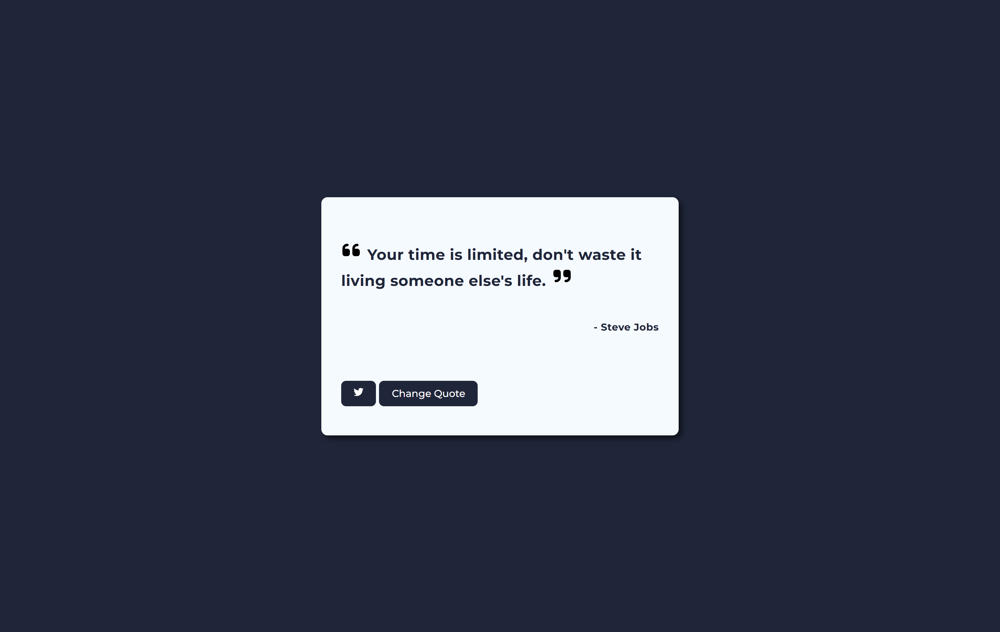

# 📚 Quotes Webpage

A simple random quote generator built using **React.js** and **Vite**.

---

## 🔗 Live Demo

👉 [Check it out here](https://kichu3000.github.io/Quotes-webpage/)

---

## 🧠 Features

- Displays a random quote on each load
- Uses a **local JSON file** as the quote source
- Clean and minimal design
- (Optional) You can switch to an API like [Quotable](https://api.quotable.io/quotes/random) if desired

---

## 🖼️ Screenshot




---

## 🛠️ Tech Stack

- React.js
- Vite
- HTML/CSS
- JavaScript (Fetch API for local JSON)

## 📦 Installation

```bash
git clone https://github.com/kichu3000/Quotes-webpage.git
cd Quotes-webpage
npm install
npm run dev
```

## 📁 Folder Structure

```
Quotes-webpage/
├── public/
│ └── index.html
├── src/
│ ├── components/
│ │ └── QuoteBox.jsx
│ └── data/
│ └── quotes.json
├── vite.config.js
├── package.json
└── README.md
```

### 👨‍💻 Author

Made with ❤️ by Kichu
